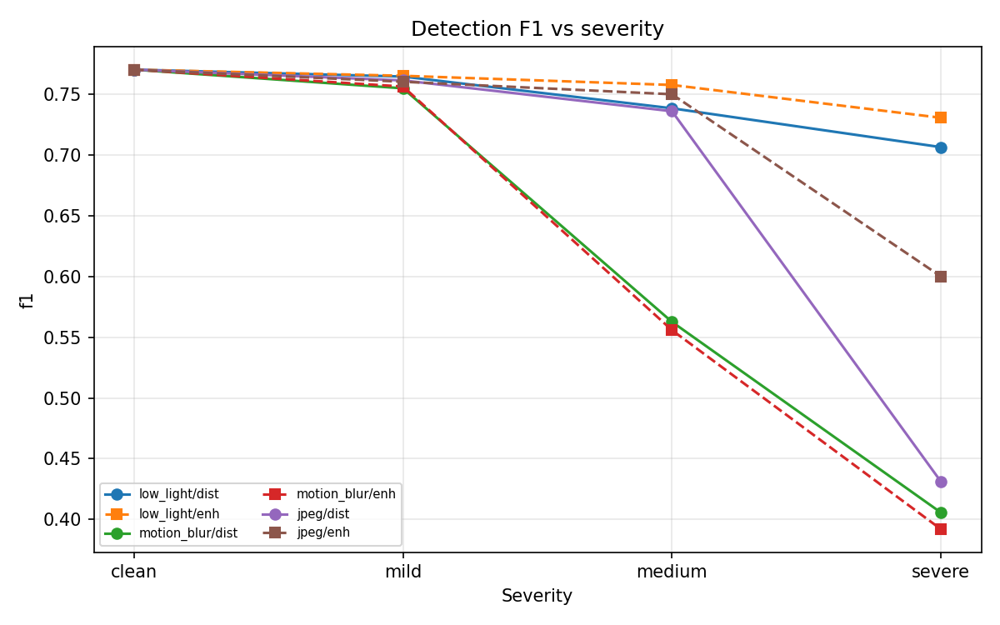
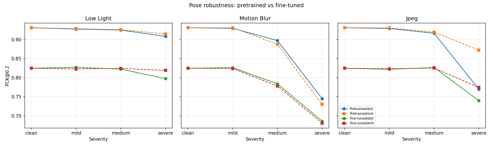
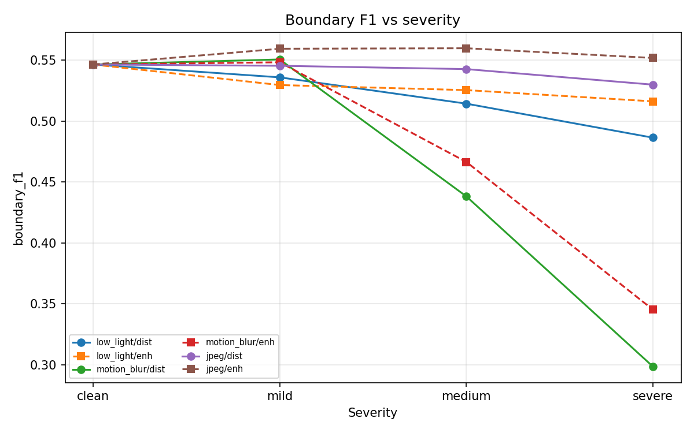
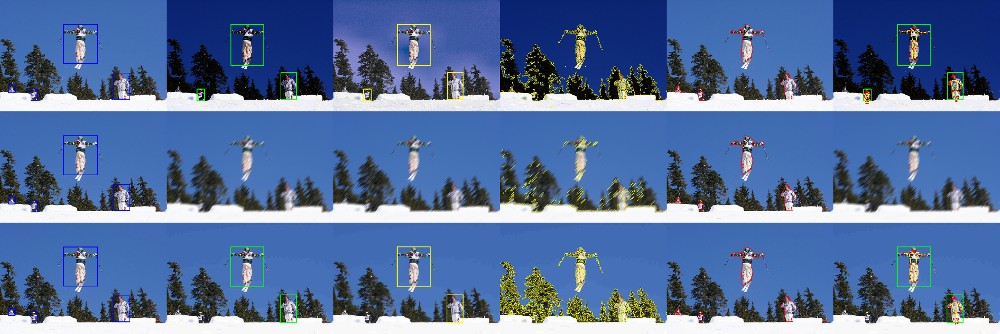

# Robust Human Perception Under Surveillance Degradation

**Multi-task robustness evaluation of human perception under low light, motion blur, and JPEG compression.**

## Objective

Evaluate how surveillance-camera degradation affects three levels of human
perception—person-boundary extraction, person detection, and human pose estimation—and
measure whether classical enhancement or corruption-aware pose fine-tuning
recovers performance. The final experiment uses the same deterministic
150-image COCO-person validation subset for every condition.

## Key findings

- Motion blur caused the largest overall degradation across the three tasks.
- Severe JPEG enhancement produced the strongest recovery: detection F1
  improved from **0.431 to 0.600**.
- Improving low-level boundary quality did not always improve detection or
  pose estimation.
- The 800-image corruption-aware fine-tuning run underperformed the original
  pretrained pose model.
- Final outputs contain **11,400 validated per-image rows**, with no duplicate
  experiment rows and no failed evaluations.

## Motivation

Fixed surveillance cameras frequently produce degraded imagery: nighttime illumination, motion blur from subject motion or slow shutter speeds, and heavy compression on bandwidth-limited links. A system may still detect that a person exists while failing to localize limbs. This project measures that gap.

## Research question

> How do person-boundary extraction, person detection, and human pose
> estimation respond to increasing surveillance-like degradation, and how
> much performance can be recovered through classical enhancement or
> corruption-aware fine-tuning?

## Course requirements mapping

| Requirement | Implementation |
|---|---|
| Public dataset + GT | COCO 2017 person subset (boxes, masks, keypoints) |
| 3 tasks (low + high level) | Canny person-boundary; YOLOv8n detection; YOLOv8n-pose |
| 3 distortions | Low light, motion blur, JPEG |
| Clean / distorted / enhanced / fine-tuned | Scripts `01`–`05` |
| ≥1 DL fine-tune | YOLOv8n-pose only (mixed corruptions) |
| Severity curves | mild / medium / severe + PSNR vs clean |
| Reproducible GitHub repo | Scripts, configs, tests, README, Colab notebook |

## Dataset

COCO 2017 person images with:

- person bounding boxes
- person segmentation masks (pycocotools)
- 17 human keypoints + visibility

**Important:** this repository **never downloads `train2017.zip`**.  
It downloads annotation JSON (optional) and **selectively obtains only chosen image files**.

If a local `val2017.zip` / `train2017.zip` already exists, selected images are **extracted from the zip** (no full unzip). Otherwise HTTP per-file download is used.

If a previous demo run overwrote annotation JSON with tiny files, `ensure_annotations` re-extracts the real JSON from `annotations_trainval2017.zip`.

The final evaluation uses **150 validation images**, selected deterministically
with seed 42. Every image contains at least one annotated person with valid
keypoints. The result set contains 11,400 per-image rows and 76 aggregate
groups; every group contains exactly the same 150 images.

## Exact three tasks

1. **Boundary (low-level):** Canny edges vs GT person silhouette (person-neighborhood evaluation).
2. **Detection (high-level):** YOLOv8n, person class only.
3. **Pose (high-level):** YOLOv8n-pose, COCO-17 keypoints.

## Exact three distortions

| Distortion | Mild | Medium | Severe |
|---|---|---|---|
| Low light (γ) | 1.5 | 2.2 | 3.0 |
| Motion blur (kernel length) | 5 | 15 | 25 |
| JPEG quality | 50 | 20 | 5 |

Quality vs clean is reported as **MSE** and **PSNR** (not “SNR”).

## Enhancements

| Distortion | Enhancement |
|---|---|
| Low light | CLAHE on LAB luminance + gamma brightening |
| Motion blur | Stable unsharp masking (σ=1.2, amount=0.6) |
| JPEG | Bilateral filtering |

## Fine-tuning design

- Model: `yolov8n-pose.pt` only (detector is not fine-tuned).
- Mixture: 25% clean + 25% each distortion; severities sampled uniformly.
- Geometry / labels unchanged.
- Training used the selected 800-image COCO-person training subset exported to
  Ultralytics pose format and was run in Colab on a GPU at 416-pixel input
  resolution.
- Training was configured for a maximum of 20 epochs with early stopping
  enabled. It stopped early after validation performance stopped improving,
  and the best checkpoint was selected from the completed epochs.
- The resulting checkpoint is identified as `pose_robust_ft_best`.
- The fine-tuned model was evaluated on exactly the same 150 validation images
  and 19 clean/distorted/enhanced conditions as the pretrained pose model.
- Fine-tuning was evaluated as a robustness intervention; it did **not**
  improve final pose localization.

## Experimental matrix

- Clean
- 9 distorted conditions
- 9 enhanced conditions
- Fine-tuned pose on clean + 9 distorted + 9 enhanced

## Metrics

- Boundary: precision, recall, F1, mean edge distance (person band)
- Detection: precision, recall, F1, miss rate, mean confidence, TP/FP/FN (IoU≥0.5 matching)
- Pose: simplified per-person OKS, PCK@0.2 and PCK@0.5 normalized by
  `max(box_width, box_height)`, and normalized keypoint error using the box
  diagonal
- Image quality: MSE, PSNR vs clean

MSE and PSNR quantify image degradation relative to the clean reference; they
are not used as substitutes for task-level accuracy.

Detection plots and reported comparisons use **F1 and recall**. Official COCO
AP50 was not computed and is not claimed.

## Installation

```bash
python -m venv .venv
# Windows: .venv\Scripts\activate
pip install -r requirements.txt
```

Device handling: `--device auto|cpu|0`. If `0` is requested without CUDA, the code **warns and falls back to CPU**.

## Data preparation (no full train zip)

Cleanup failed partial archive:

```powershell
Remove-Item "data\raw\coco\train2017.zip" -Force -ErrorAction SilentlyContinue
```

### Smoke validation subset (10 images)

```bash
python scripts/00_prepare_data.py --skip-train-images --val-n 10 --seed 42 --download-selected-val
```

### Final validation subset (150 images)

```bash
python scripts/00_prepare_data.py --skip-train-images --val-n 150 --seed 42 --download-selected-val
```

### Selected training images (800) + YOLO export

```bash
python scripts/00_prepare_data.py --train-n 800 --val-n 150 --seed 42 --download-selected-train --download-selected-val --export-yolo
python scripts/03_export_pose_training.py --seed 42
python scripts/09_package_colab_dataset.py
```

## Evaluation commands

### Smoke evaluation

Use a separate temporary result directory or clear the current result tables
before running smoke tests.

```bash
python scripts/01_run_clean.py --device auto --max-images 10 --imgsz 416
python scripts/02_run_distort_enhance.py --device auto --max-images 10 --imgsz 416
```

### Fresh final evaluation

Start from an empty `results/coco_person/tables/` directory. Do not mix smoke
results with the final 150-image evaluation.

```bash
python scripts/01_run_clean.py --device auto --max-images 150 --imgsz 416
python scripts/02_run_distort_enhance.py --device auto --max-images 150 --imgsz 416
```

Fine-tune locally only if needed; CPU training may be very slow:

```bash
python scripts/04_finetune_pose.py --device auto --epochs 20 --imgsz 416 --patience 5
```

Evaluate the fine-tuned weights:

```bash
python scripts/05_eval_finetuned.py --weights results/coco_person/checkpoints/pose_robust_ft_best.pt --device auto --max-images 150 --imgsz 416
```

Validate and generate outputs:

```bash
python scripts/08_validate_results.py
python scripts/06_make_plots.py
python scripts/07_visualize_samples.py --severity medium --device auto
```

Use `--resume` only to continue an interrupted run after confirming that the
existing table contains no duplicate experiment keys.

## Colab workflows

### Fine-tuning

1. Package the training subset with `python scripts/09_package_colab_dataset.py`.
2. Upload the package to Google Drive.
3. Open `colab/train_pose_colab.ipynb` with a GPU runtime.
4. Save the resulting `pose_robust_ft_best.pt` checkpoint.

### Final evaluation

Use `notebooks/robust_human_eval_colab.ipynb` for a fresh, complete evaluation.
The notebook starts from a clean result directory, repairs local paths, runs all
three evaluation stages, validates exact row counts, and exports the final ZIP.

## Results

The final tables are:

- `results/coco_person/tables/val_per_image.csv` — 11,400 rows
- `results/coco_person/tables/val_aggregate.csv` — 76 experiment groups

Validation found 0 duplicate experiment rows, 0 failed rows, and exactly 150
images per group. Files under `results/demo/` are early prototype outputs and
are not used below.

### Clean baseline

| Task/model | Primary metric | Clean value |
|---|---|---:|
| Canny boundary | Boundary F1 | 0.547 |
| YOLOv8n detection | Detection F1 | 0.770 |
| YOLOv8n detection | Recall | 0.736 |
| Pretrained YOLOv8n-pose | PCK@0.2 | 0.931 |
| Pretrained YOLOv8n-pose | OKS mean | 0.431 |
| Fine-tuned pose | PCK@0.2 | 0.825 |
| Fine-tuned pose | OKS mean | 0.334 |

### Severe degradation and enhancement

Values below use the pretrained model for pose. “Enhanced” means the
distortion-specific preprocessing method was applied.

| Distortion | Boundary F1 raw → enhanced | Detection F1 raw → enhanced | Pose PCK@0.2 raw → enhanced |
|---|---:|---:|---:|
| Low light, severe | 0.486 → 0.516 | 0.707 → 0.731 | 0.908 → 0.915 |
| Motion blur, severe | 0.298 → 0.345 | 0.406 → 0.392 | 0.745 → 0.730 |
| JPEG, severe | 0.530 → 0.552 | 0.431 → 0.600 | 0.770 → 0.872 |

### Fine-tuned pose comparison

The corruption-aware fine-tuned model underperformed the pretrained pose model
in all 19 matched conditions. On clean images, PCK@0.2 fell from **0.931 to
0.825**, OKS mean fell from **0.431 to 0.334**, and normalized keypoint error
increased from **0.052 to 0.082**. Under severe motion blur, pretrained versus
fine-tuned PCK@0.2 was **0.745 versus 0.686**; after unsharp enhancement it was
**0.730 versus 0.681**.

This is a valid negative result: the small mixed-corruption training set did
not provide enough diversity or optimization stability to preserve the
pretrained model's localization accuracy. Fine-tuning should therefore not be
presented as a recovery method in this experiment.

All final figures are generated from
`results/coco_person/tables/val_aggregate.csv`. Run
`python scripts/06_make_plots.py` to regenerate the PNG/PDF outputs.

## Selected figures

### Detection F1 versus severity



### Pose PCK versus severity



### Boundary F1 versus severity



### Qualitative comparison



## Hypothesis outcomes

1. **Supported:** higher severity generally reduced task performance.
2. **Supported:** motion blur was the most damaging distortion overall,
   especially at medium and severe levels.
3. **Partially evaluated:** fine-grained pose localization was highly
   degradation-sensitive, but the final aggregate schema does not contain a
   complete person-size or per-joint breakdown.
4. **Rejected:** corruption-aware fine-tuning did not recover pose
   performance; it reduced localization accuracy in every matched condition.
5. **Supported:** visual/edge improvement did not reliably imply better
   detection or pose performance.

## Discussion

Motion blur produced the clearest cross-task failure. At severe blur, boundary
F1 fell from 0.547 clean to 0.298, detection F1 fell from 0.770 to 0.406, and
pretrained pose PCK@0.2 fell from 0.931 to 0.745. Stable unsharp masking raised
boundary F1 to 0.345, but detection F1 declined further to 0.392 and pose
PCK@0.2 declined to 0.730. This directly demonstrates that restoring stronger
low-level edges does not guarantee useful high-level features.

Severe JPEG compression produced the strongest enhancement recovery.
Bilateral filtering raised detection F1 by 0.169 (0.431 → 0.600) and pose
PCK@0.2 by 0.103 (0.770 → 0.872), while boundary F1 improved more modestly
(0.530 → 0.552). Low-light enhancement produced smaller but generally
positive recovery at medium and severe levels.

The fine-tuned pose model detected more matched people in several conditions,
but its keypoints were less accurately localized. Its clean normalized
keypoint error was 58% higher than the pretrained model (0.082 versus 0.052).
The result suggests overfitting, insufficient training diversity, or an
optimization/configuration mismatch in the small corruption-aware run.

## Limitations

- The 150-image validation subset is deterministic and consistent, but it is
  not the full COCO validation set.
- Detection evaluation reports F1/precision/recall at IoU 0.5 matching; it
  does not report official COCO AP50 or mAP.
- Pose OKS is a per-instance mean summary, not official COCO keypoint AP.
- The final aggregate table does not include complete per-joint or person-size
  metrics, so those hypotheses cannot be fully quantified from final outputs.
- Motion-blur enhancement uses fixed stable unsharp-mask parameters
  (σ=1.2, amount=0.6); it is not a learned or blind-deconvolution method.
- One small fine-tuning run is not sufficient to establish that
  corruption-aware training is generally ineffective.
- Colab and local environments may produce minor numerical differences.

## Reproducibility

- Configs under `configs/`
- Deterministic seeds for split selection and corruptions
- Resume keys: `image_id|task|condition|model|weights|enhanced`
- `pytest -q` for unit tests (no full COCO required)
- Final validation: `python scripts/08_validate_results.py`
- Automated tests: `python -m pytest -q` — **15 passed**
- Figures are derived from the committed `val_aggregate.csv`; neither final
  result CSV is regenerated by plotting.

## Hardware

Final model evaluation was run in Colab on CUDA device 0 at 416-pixel input
size. Environment/device resolution is implemented in `src/common/device.py`.

## Repository structure

```text
configs/                 Dataset, distortion, and training settings
data/splits/             Deterministic selected COCO image IDs/metadata
src/common/              Device, I/O, logging, and reproducibility helpers
src/dataset/             COCO selection, masks, selective download, YOLO export
src/distortions/         Exactly three distortion implementations
src/enhancement/         CLAHE/gamma, stable unsharp, bilateral filtering
src/tasks/               Canny boundary, YOLO detection, YOLO pose
src/eval/                Metrics, result schema, aggregation, condition runner
src/train/               Mixed-corruption export and pose fine-tuning
src/viz/                 Quantitative plots and qualitative overlays
scripts/                 Reproducible numbered workflows
results/coco_person/     Final validated tables, figures, and qualitative data
results/demo/            Non-final prototype outputs
tests/                   Synthetic unit tests
colab/                   GPU fine-tuning notebook
slides/                  Presentation assets
```

## References

- Lin et al., Microsoft COCO, ECCV 2014
- Ultralytics YOLOv8
- Canny, A Computational Approach to Edge Detection, 1986
- Course project brief: Image Processing / Vision robustness evaluation

## License / data

COCO terms apply to images/annotations. Project code is for coursework.
